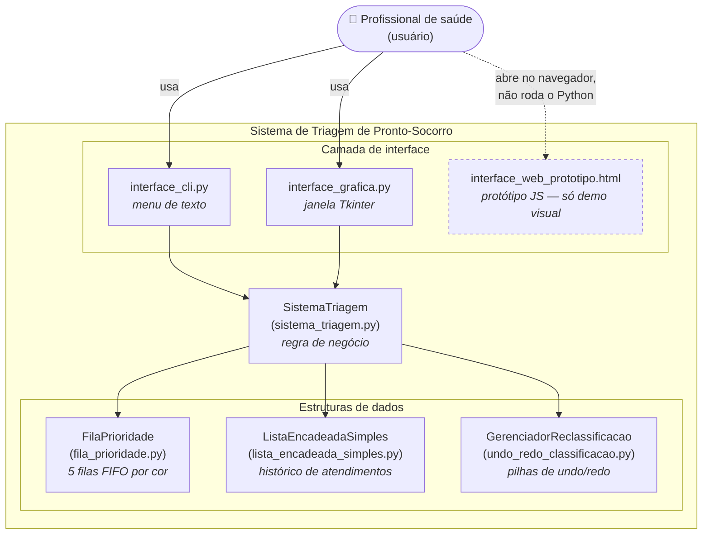

# Arquitetura do sistema

Este documento descreve como o sistema está estruturado, para ajudar
quem for mexer no código depois (incluindo o "eu do futuro").

## Visão geral

O projeto segue uma separação simples em camadas: **interfaces** (como
o usuário interage) → **núcleo do domínio** (`SistemaTriagem`, que
concentra toda a regra de negócio) → **estruturas de dados** (onde a
informação de fato é guardada e organizada).

Nenhuma interface acessa uma estrutura de dados diretamente — tudo
passa por `SistemaTriagem`. Isso é o que permite ter três formas
diferentes de usar o sistema (linha de comando, janela gráfica, e um
protótipo web) sem duplicar nenhuma regra de negócio.

## Diagrama de componentes

> `interface_web_prototipo.html` está pontilhado porque é uma
> reimplementação em JavaScript feita só para demonstração visual
> rápida — ela não chama o código Python nem o `SistemaTriagem`. Ver
> [`README.md`](../README.md#sobre-interface_web_prototipohtml) para
> detalhes.

## Fluxo de dados (exemplo: atender um paciente)

1. O usuário aciona "Atender próximo" na `interface_cli.py` ou na
   `interface_grafica.py`.
2. A interface chama `SistemaTriagem.atender_proximo()` — nenhuma
   lógica de prioridade vive na interface.
3. `SistemaTriagem` pede à `FilaPrioridade` o próximo paciente
   (respeitando a cor mais grave e, dentro da mesma cor, ordem de
   chegada).
4. O paciente atendido é removido da `FilaPrioridade` e inserido na
   `ListaEncadeadaSimples` (histórico).
5. `SistemaTriagem` devolve o paciente atendido para a interface, que
   só se preocupa em desenhar o resultado na tela.

O fluxo de reclassificação/undo/redo segue o mesmo princípio: a
interface só chama `SistemaTriagem.reclassificar_paciente(...)` /
`desfazer_reclassificacao(...)`, que por sua vez delega ao
`GerenciadorReclassificacao` (pilhas de undo/redo sobre `PilhaArray`).

## Responsabilidade de cada módulo

| Módulo | Responsabilidade |
|---|---|
| `sistema_triagem.py` | Único ponto de entrada da regra de negócio; integra as demais estruturas |
| `interface_cli.py` | Apresentação em texto (menu de terminal) |
| `interface_grafica.py` | Apresentação em janela (Tkinter) |
| `interface_web_prototipo.html` | Protótipo visual em HTML/CSS/JS, independente do Python |
| `fila_prioridade.py` / `fila_encadeada.py` | Fila de espera organizada por gravidade |
| `lista_encadeada_simples.py` | Histórico de pacientes já atendidos |
| `pilha_array.py` / `undo_redo_classificacao.py` | Desfazer/refazer reclassificações |
| `paciente.py` | Estrutura de dados do paciente (nome, id, cor, hora) |
| `validacao.py` | Regras de validação (cores válidas, nomes, etc.) |
| `utils.py` | Funções auxiliares (geração de id, formatação de hora) |

## Decisões técnicas

As decisões de design mais importantes (e por que foram tomadas) estão
registradas como ADRs em [`docs/decisoes/`](decisoes/). Ver também o
[`relatorio.md`](../relatorio.md) para a análise completa de
complexidade de cada operação.
